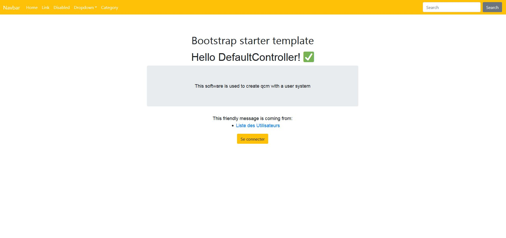

Projet Slam-Quizz
===
Initialization
---

`git clone https://github.com/AugustinDmrt/Slam-Quizz.git`

Instalation
---

`cd Slam-Quizz`

`composer install`
	
Examples
----

Config
---

1.Rename .env in .env.local

2.Search in .env.locale and replace :

DATABASE_URL="insert you database url"

db_user :"Your database users"

db_password :"Your database password"

db_name :"Your database name"

See the result
---

`php bin/console server:run`

Open explorer and tapes on url localhost:8000

	
